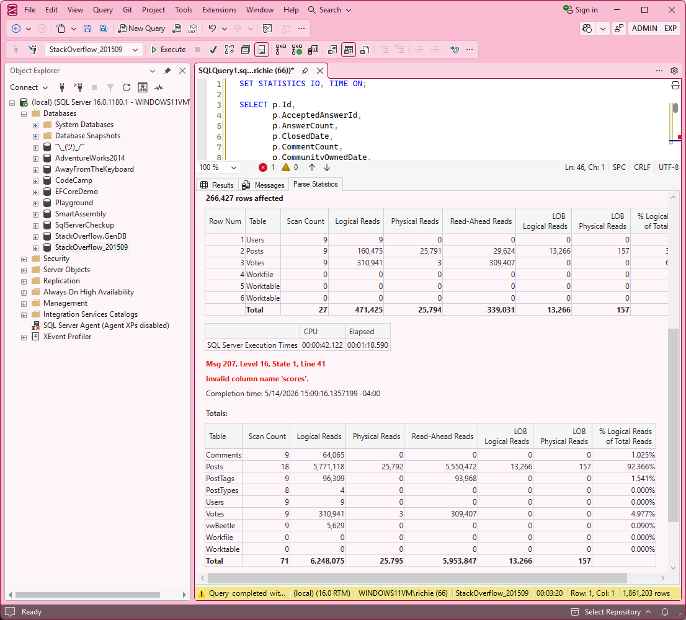
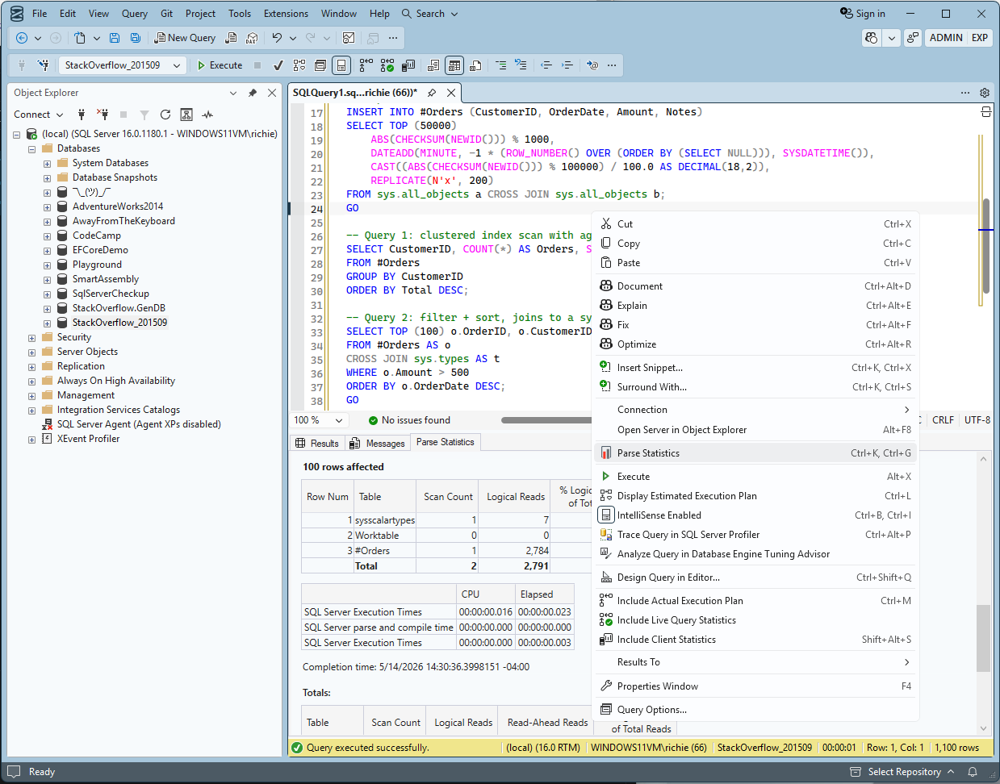
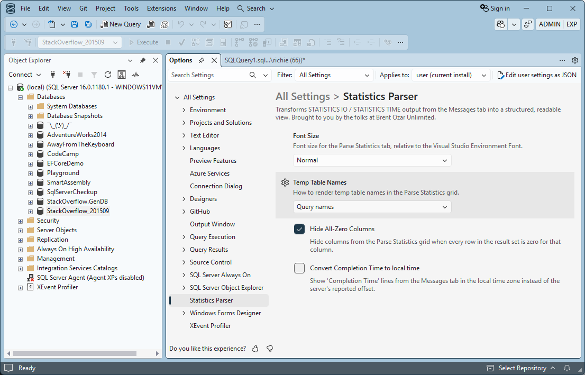

# Statistics Parser SSMS Extension

[](https://ci.appveyor.com/project/BrentOzarULTD/statisticsparserextension)
[![issues badge]][issues]
[![contributors_badge]][contributors]
[![licence badge]][licence]
[![forks badge]][forks]
[![stars badge]][stars]

An SSMS 22 extension that parses `STATISTICS IO` / `STATISTICS TIME` output from the Messages tab and renders it as a sortable, readable third tab — **Parse Statistics** — alongside the native Results and Messages tabs.

C# port of [Jorriss/StatisticsParser](https://github.com/Jorriss/StatisticsParser), brought into the query window so you never have to copy/paste output into a separate web tool again.

## Features

- One-click parsing via right-click in the query window or `Ctrl+K, Ctrl+G`
- Per-statement IO tables with table totals and `% Logical Reads` share
- CPU / Elapsed time tables formatted as `hh:mm:ss.ms`
- Cross-statement **Totals** section: grand IO total per table + grand time total
- Auto-refresh on subsequent query executions (F5)
- Respects SSMS themes
- Rows-affected, error messages (red), and completion timestamps surfaced inline

## Screenshots

The Parse Statistics tab populated with per-statement IO and time tables (SSMS Bubblegum theme):



## Requirements

| Component | Version |
|---|---|
| SSMS | 22 (64-bit, VS 2026 shell) |
| .NET Framework | 4.8 (ships with SSMS 22) |

## Install

1. Download `StatisticsParser.vsix` from [Releases](https://github.com/BrentOzarULTD/StatisticsParserExtension/releases).
2. Close SSMS.
3. Run SSMS 22's bundled VSIX installer against the downloaded file. Change the directory to the path where you downloaded StatisticsParser.vsix:

   ```powershell
   & "C:\Program Files\Microsoft SQL Server Management Studio 22\Release\Common7\IDE\VSIXInstaller.exe" StatisticsParser.vsix
   ```

   Confirm the prompt in the VSIX Installer dialog.
4. Launch SSMS.

Double-clicking the `.vsix` does **not** work on most machines: Windows associates the file with Visual Studio's installer (or shows a "Select an app" picker), and neither route knows how to install into SSMS 22.

## Use

1. Run a query with `SET STATISTICS IO, TIME ON;`.
2. Right-click anywhere in the query body and choose **Parse Statistics** (or press `Ctrl+K, Ctrl+G`).

   

3. The **Parse Statistics** tab appears next to the Messages tab.

Subsequent executions in the same query window auto-refresh the tab.

## Options

Open **Tools → Options → Statistics Parser** to customize how the Parse Statistics tab renders.



- **Font Size** — Small, Normal, Large, or Extra Large, scaled relative to the Visual Studio Environment Font. Handy for screen sharing or high-DPI displays.
- **Temp Table Names** — How SQL Server's padded temp table names like `#Orders______________________________0000000F8901` are displayed:
  - *Query names* (default) — strips the auto-generated suffix, showing `#Orders` as it appears in the query.
  - *Shorten names* — collapses long underscore runs to `…`, e.g. `#Orders__…__0000000F8901`. Hover the cell to see the full raw name.
  - *Do not change names* — show the raw name exactly as STATISTICS IO emits it.
- **Hide All-Zero Columns** (default on) — Hide IO columns (e.g. `LOB Physical Reads`, `Page Server Reads`) when every row in the result set is zero, cutting visual noise.
- **Convert Completion Time to local time** — Display `Completion Time` lines from the Messages tab in your local time zone instead of the server's reported offset.

## Uninstall

SSMS 22 does not include a Manage Extensions dialog, so the extension must be removed from the command line. Close SSMS, then run:

```powershell
& "C:\Program Files\Microsoft SQL Server Management Studio 22\Release\Common7\IDE\VSIXInstaller.exe" /uninstall:StatisticsParser.4A9EFF2E-819B-453D-BE4C-5DF7B343C0E7
```

Confirm the prompt in the VSIX Installer dialog, then reopen SSMS.

## Build from source

```powershell
dotnet build StatisticsParserExtension.sln
dotnet test source\StatisticsParser.Core.Tests
msbuild source\StatisticsParser.Vsix /p:Configuration=Release /p:Platform=x64
```

The VSIX output lands at `source\StatisticsParser.Vsix\bin\x64\Release\StatisticsParser.vsix`.

## Projects

- [source/StatisticsParser.Core/](source/StatisticsParser.Core/) — `netstandard2.0` parser and models, no external dependencies
- [source/StatisticsParser.Core.Tests/](source/StatisticsParser.Core.Tests/) — xUnit tests on `net8.0`
- [source/StatisticsParser.Vsix/](source/StatisticsParser.Vsix/) — `net48` VSIX with WPF UI and SSMS integration


## Report a bug

Open an issue at [github.com/BrentOzarULTD/StatisticsParserExtension/issues](https://github.com/BrentOzarULTD/StatisticsParserExtension/issues). Please include your SSMS 22 version (Help → About Statistics Parser) and a sample query whose output reproduces the problem.

## Credits

Parsing logic ported from Jorriss's [StatisticsParser](https://github.com/Jorriss/StatisticsParser).

<p align="center">
  <a href="https://www.brentozar.com/">
    
  </a>
</p>

[issues badge]: https://img.shields.io/github/issues/BrentOzarULTD/StatisticsParserExtension
[issues]: https://github.com/BrentOzarULTD/StatisticsParserExtension/issues

[contributors_badge]: https://img.shields.io/github/contributors/BrentOzarULTD/StatisticsParserExtension
[contributors]: https://github.com/BrentOzarULTD/StatisticsParserExtension/graphs/contributors

[licence badge]: https://img.shields.io/github/license/BrentOzarULTD/StatisticsParserExtension
[licence]: https://github.com/BrentOzarULTD/StatisticsParserExtension/blob/main/LICENSE

[forks badge]: https://img.shields.io/github/forks/BrentOzarULTD/StatisticsParserExtension
[forks]: https://github.com/BrentOzarULTD/StatisticsParserExtension/network/members

[stars badge]: https://img.shields.io/github/stars/BrentOzarULTD/StatisticsParserExtension
[stars]: https://github.com/BrentOzarULTD/StatisticsParserExtension/stargazers
